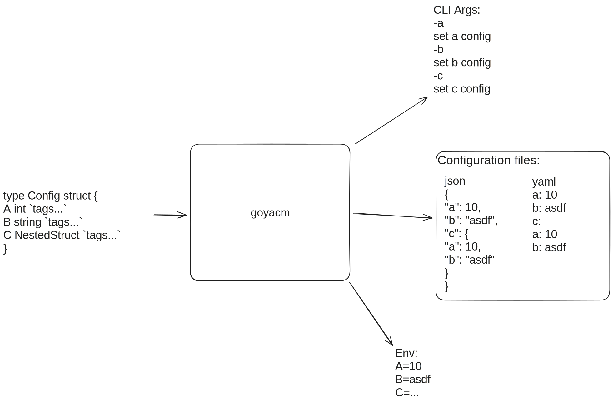

# Yet Another Configuration Manager for Go

## IMPORTANT NOTE

⚠️⚠️ **THIS PROJECT IS A WIP AND UNDER HEAVY DEVELOPMENT** ⚠️⚠️

## Description
This project aims to do the following with support for overwriting.
1. Create Flags from a struct
2. Read enviornment variables 
3. Read Configuration File

## Decisions
- [flag](https://pkg.go.dev/flag) package for creating and handling CLI arguments
- [viper](https://pkg.go.dev/flag) for handling envs and configuration files.
- Heavy usage of [reflect](https://pkg.go.dev/reflect) for struct tag reading and creation of CLI arguments.

## Goal

The goal of this project is to be used as a library to achieve the following: 

1. Speed up config creation to put the developer's focus on the actual logic.
2. Have a simple and easy-to-use interface
3. Reduce repetion

## TODOs

- Priority
    - [ ] Args overwrite env and config files
    - [ ] Envs Overwrite config files
- Naming
    - [ ] Kebab case for CLI args
    - [ ] Snake case for config files
    - [ ] Snake Case (All Caps) for envs
- Support both json and yaml
- Support nested structs
- Subcommands
- Data validation
- Tests
- Well-defined documentation for tags
- Hot reloadable config files
    - Maybe: partial hot reload (i.e. only a nested struct)